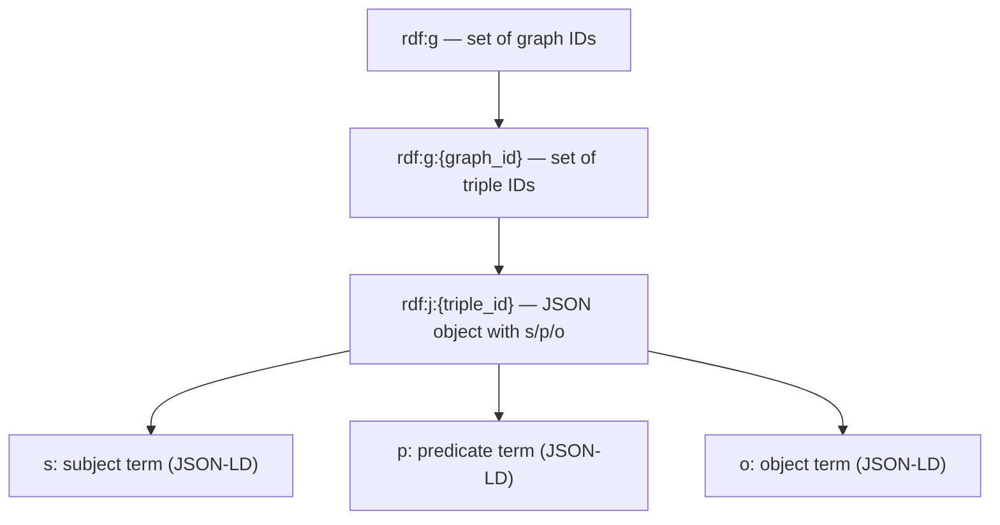
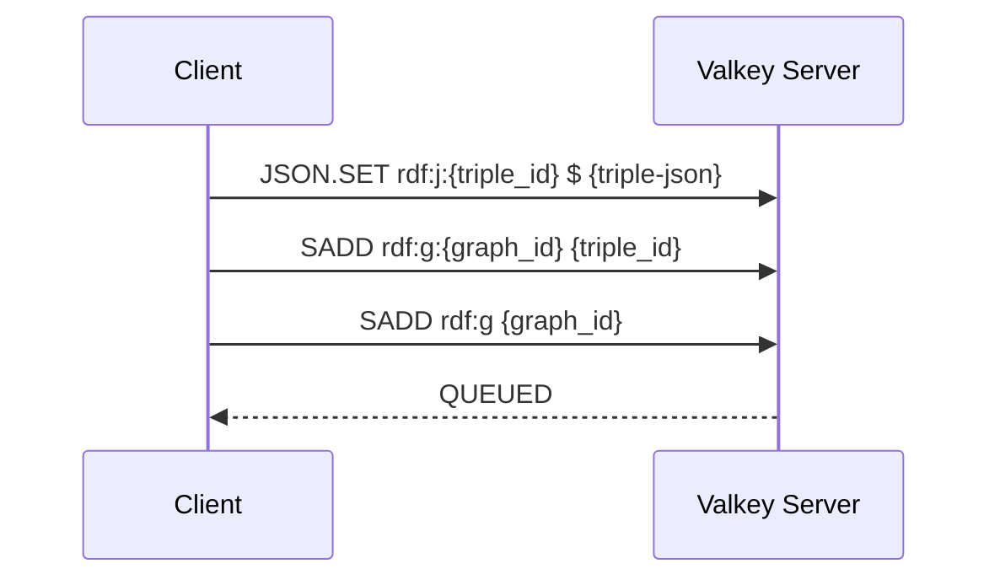
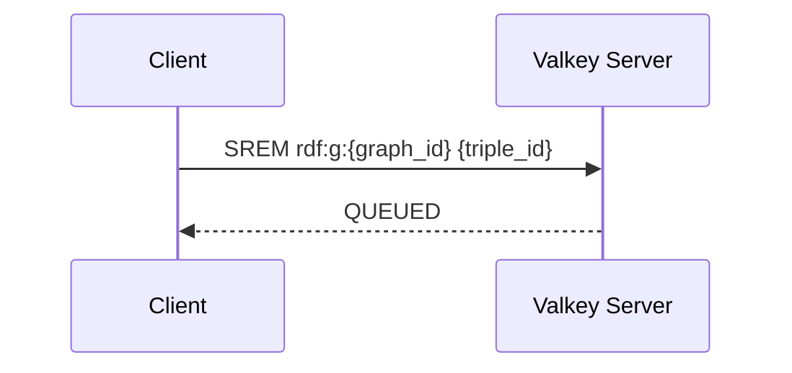
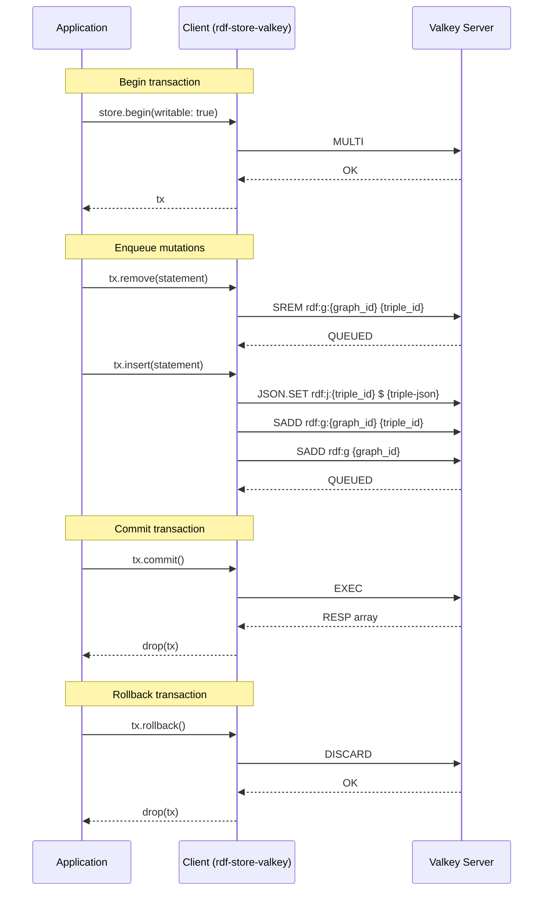

# RDF.rs Store: Valkey

[](https://unlicense.org)
[](https://blog.rust-lang.org/2025/02/20/Rust-1.85.0/)
[](https://crates.io/crates/rdf-store-valkey)
[](https://docs.rs/rdf-store-valkey)

A [Valkey] (fka Redis) storage adapter for **[RDF.rs]** knowledge graphs.

> [!TIP]
> 🚧 _We are building in public. This is presently under heavy construction._

<sub>

[[Features](#-features)] |
[[Prerequisites](#%EF%B8%8F-prerequisites)] |
[[Installation](#%EF%B8%8F-installation)] |
[[Examples](#-examples)] |
[[Reference](#-reference)] |
[[Development](#%E2%80%8D-development)]

</sub>

## ✨ Features

- Implements a scalable, high-performance RDF store backed by [Valkey].
- Compatible with [Valkey Bundle] (requires the [Valkey JSON] module).
- Built on async Rust using lazily-evaluated streams throughout.
- Plays nice with others: interoperates with Oxigraph, Rudof, and Sophia.
- 100% pure and safe Rust with minimal dependencies and no bloat.
- Supports opting out of any feature using comprehensive [feature flags].
- Adheres to the Rust API Guidelines in its [naming conventions].
- Cuts red tape: 100% free and unencumbered public domain software.

## 🛠️ Prerequisites

- [Rust] 1.85+ (2024 edition)

## ⬇️ Installation

### Installation via Cargo

```bash
cargo add rdf-store-valkey
```

### Installation in `Cargo.toml`

Enable all default features:

```toml
[dependencies]
rdf-store-valkey = { version = "0.4" }
```

Enable only specific features:

```toml
[dependencies]
rdf-store-valkey = { version = "0.4", default-features = false, features = ["tracing"] }
```

## 👉 Examples

### Running a Valkey Server

```bash
docker run -p 6379:6379 valkey/valkey-bundle
```

### Importing the Library

```rust
use rdf_store_valkey::{ValkeyStore, ValkeyTransaction};
```

### Connecting to the Store

```rust,compile_fail
let mut store = ValkeyStore::open("redis://localhost")?;
```

### Mutating the Store

```rust,compile_fail
let mut tx = store.write().await?;

tx.remove(old_quad).await?;
tx.insert(new_quad).await?;

tx.commit().await?;
```

### Accessing the Store

```rust,compile_fail
let tx = store.read().await?;

let count = tx.count(quad_pattern).await?;

tx.r#match(quad_pattern)
    .for_each(|quad| async move {
        eprintln!("{:?}", quad);
    })
    .await;
```

### Querying the Store with SPARQL

To execute SPARQL queries on the store, use the [sparql-store] crate to wrap
the underlying [`ValkeyStore`] quad store into a [`SparqlStore`]:

```rust,compile_fail
use sparql_store::SparqlStore;

let mut store: SparqlStore<ValkeyStore> =
    ValkeyStore::open("redis://localhost:6379")?.into();

let tx = store.read().await?;
```

## 📚 Reference

[docs.rs/rdf-store-valkey](https://docs.rs/rdf-store-valkey)

### Storage Schema

The current implementation is based on a triple-centric schema where triples
are uniquely identified and deduplicated by their subject-predicate-object
(SPO) hash. Graphs, in turn, are represented as sets of triple IDs.



### Sequence Diagrams

#### Insert Statement



#### Remove Statement



#### Write Transaction



### See Also

| Package | Crate | Docs |
| :------ | :---- | :--- |
| [rdf-store-idb](https://github.com/rust-rdf/rdf.rs/tree/master/lib/rdf-store-idb#readme) | [](https://crates.io/crates/rdf-store-idb) | [](https://docs.rs/rdf-store-idb) |
| [rdf-store-mongo](https://github.com/rust-rdf/rdf.rs/tree/master/lib/rdf-store-mongo#readme) | [](https://crates.io/crates/rdf-store-mongo) | [](https://docs.rs/rdf-store-mongo) |
| [rdf-store-neo4j](https://github.com/rust-rdf/rdf.rs/tree/master/lib/rdf-store-neo4j#readme) | [](https://crates.io/crates/rdf-store-neo4j) | [](https://docs.rs/rdf-store-neo4j) |
| [rdf-store-oxigraph](https://github.com/rust-rdf/rdf.rs/tree/master/lib/rdf-store-oxigraph#readme) | [](https://crates.io/crates/rdf-store-oxigraph) | [](https://docs.rs/rdf-store-oxigraph) |
| [rdf-store-postgres](https://github.com/rust-rdf/rdf.rs/tree/master/lib/rdf-store-postgres#readme) | [](https://crates.io/crates/rdf-store-postgres) | [](https://docs.rs/rdf-store-postgres) |
| [rdf-store-qlever](https://github.com/rust-rdf/rdf.rs/tree/master/lib/rdf-store-qlever#readme) | [](https://crates.io/crates/rdf-store-qlever) | [](https://docs.rs/rdf-store-qlever) |
| [rdf-store-sqlite](https://github.com/rust-rdf/rdf.rs/tree/master/lib/rdf-store-sqlite#readme) | [](https://crates.io/crates/rdf-store-sqlite) | [](https://docs.rs/rdf-store-sqlite) |
| [rdf-store-turso](https://github.com/rust-rdf/rdf.rs/tree/master/lib/rdf-store-turso#readme) | [](https://crates.io/crates/rdf-store-turso) | [](https://docs.rs/rdf-store-turso) |
| [rdf-store-valkey](https://github.com/rust-rdf/rdf.rs/tree/master/lib/rdf-store-valkey#readme) | [](https://crates.io/crates/rdf-store-valkey) | [](https://docs.rs/rdf-store-valkey) |
| [rdf-store-virtuoso](https://github.com/rust-rdf/rdf.rs/tree/master/lib/rdf-store-virtuoso#readme) | [](https://crates.io/crates/rdf-store-virtuoso) | [](https://docs.rs/rdf-store-virtuoso) |

## 👨‍💻 Development

```bash
git clone https://github.com/rust-rdf/rdf.rs.git
```

---

[](https://x.com/intent/post?url=https%3A%2F%2Fgithub.com%2Frust-rdf%2Frdf.rs&text=RDF.rs)
[](https://reddit.com/submit?url=https%3A%2F%2Fgithub.com%2Frust-rdf%2Frdf.rs&title=RDF.rs)
[](https://news.ycombinator.com/submitlink?u=https%3A%2F%2Fgithub.com%2Frust-rdf%2Frdf.rs&t=RDF.rs)
[](https://www.facebook.com/sharer/sharer.php?u=https%3A%2F%2Fgithub.com%2Frust-rdf%2Frdf.rs)
[](https://www.linkedin.com/sharing/share-offsite/?url=https%3A%2F%2Fgithub.com%2Frust-rdf%2Frdf.rs)

[feature flags]: https://github.com/rust-rdf/rdf.rs/blob/master/lib/rdf-store-valkey/Cargo.toml
[naming conventions]: https://rust-lang.github.io/api-guidelines/naming.html

[ACID transactions]: https://www.mongodb.com/docs/manual/core/transactions/
[IndexedDB]: https://developer.mozilla.org/en-US/docs/Web/API/IndexedDB_API
[MongoDB]: https://mongodb.org
[Neo4j]: https://neo4j.com
[Oxigraph]: https://oxigraph.org
[PostgreSQL]: https://postgresql.org
[QLever]: https://qlever.dev
[RDF]: https://www.w3.org/TR/rdf12-concepts/
[RDF.rs]: https://github.com/rust-rdf/rdf.rs
[Rust]: https://rust-lang.org
[SPARQL]: https://www.w3.org/TR/sparql12-query/
[SQLite]: https://sqlite.org
[Turso]: https://turso.tech
[Valkey]: https://valkey.io
[Valkey Bundle]: https://valkey.io/topics/valkey-bundle/
[Valkey JSON]: https://valkey.io/topics/valkey-json/
[Virtuoso]: https://virtuoso.openlinksw.com
[sparql-store]: https://github.com/rust-rdf/sparql.rs#readme

[`IdbStore`]: https://docs.rs/rdf-store-idb/latest/rdf_store_idb/struct.IdbStore.html
[`MongoStore`]: https://docs.rs/rdf-store-mongo/latest/rdf_store_mongo/struct.MongoStore.html
[`Neo4jStore`]: https://docs.rs/rdf-store-neo4j/latest/rdf_store_neo4j/struct.Neo4jStore.html
[`OxigraphStore`]: https://docs.rs/rdf-store-oxigraph/latest/rdf_store_oxigraph/struct.OxigraphStore.html
[`PostgresStore`]: https://docs.rs/rdf-store-postgres/latest/rdf_store_postgres/struct.PostgresStore.html
[`QleverStore`]: https://docs.rs/rdf-store-qlever/latest/rdf_store_qlever/struct.QleverStore.html
[`SparqlStore`]: https://docs.rs/sparql-store/latest/sparql_store/struct.SparqlStore.html
[`SqliteStore`]: https://docs.rs/rdf-store-sqlite/latest/rdf_store_sqlite/struct.SqliteStore.html
[`TursoStore`]: https://docs.rs/rdf-store-turso/latest/rdf_store_turso/struct.TursoStore.html
[`ValkeyStore`]: https://docs.rs/rdf-store-valkey/latest/rdf_store_valkey/struct.ValkeyStore.html
[`VirtuosoStore`]: https://docs.rs/rdf-store-virtuoso/latest/rdf_store_virtuoso/struct.VirtuosoStore.html
