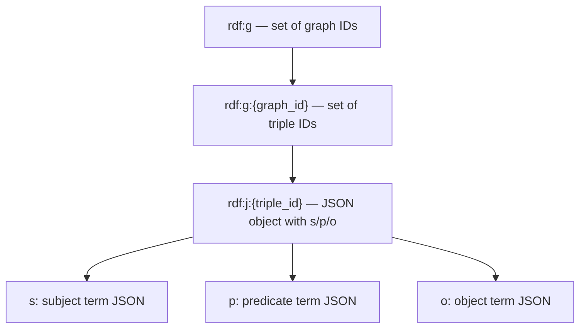

# RDF.rs: Valkey Store

[](https://unlicense.org)
[](https://blog.rust-lang.org/2025/02/20/Rust-1.85.0/)
[](https://crates.io/crates/rdf-store-valkey)
[](https://docs.rs/rdf-store-valkey)

**RDF.rs** is a [Rust] framework for working with [RDF] knowledge graphs.

> [!TIP]
> 🚧 _We are building in public. This is presently under heavy construction._

<sub>

[[Features](#-features)] |
[[Prerequisites](#%EF%B8%8F-prerequisites)] |
[[Installation](#%EF%B8%8F-installation)] |
[[Examples](#-examples)] |
[[Reference](#-reference)] |
[[Development](#%E2%80%8D-development)]

</sub>

## ✨ Features

- 100% pure and safe Rust with minimal dependencies and no bloat.
- Supports opting out of any feature using comprehensive [feature flags].
- Adheres to the Rust API Guidelines in its [naming conventions].
- Cuts red tape: 100% free and unencumbered public domain software.

## 🛠️ Prerequisites

- [Rust] 1.85+ (2024 edition)

## ⬇️ Installation

### Installation via Cargo

```bash
cargo add rdf-store-valkey
```

### Installation in `Cargo.toml`

Enable all default features:

```toml
[dependencies]
rdf-store-valkey = { version = "0.3" }
```

Enable only specific features:

```toml
[dependencies]
rdf-store-valkey = { version = "0.3", default-features = false, features = ["tls"] }
```

## 👉 Examples

### Importing the Library

```rust
use rdf_store_valkey::{ValkeyStore, ValkeyTransaction};
```

## 📚 Reference

[docs.rs/rdf-store-valkey](https://docs.rs/rdf-store-valkey)

### Storage Schema



## 👨‍💻 Development

```bash
git clone https://github.com/rust-rdf/rdf.rs.git
```

---

[](https://x.com/intent/post?url=https://github.com/rust-rdf/rdf.rs/tree/master/lib/rdf-store-valkey&text=rdf-store-valkey)
[](https://reddit.com/submit?url=https://github.com/rust-rdf/rdf.rs/tree/master/lib/rdf-store-valkey&title=rdf-store-valkey)
[](https://news.ycombinator.com/submitlink?u=https://github.com/rust-rdf/rdf.rs/tree/master/lib/rdf-store-valkey&t=rdf-store-valkey)
[](https://www.facebook.com/sharer/sharer.php?u=https://github.com/rust-rdf/rdf.rs/tree/master/lib/rdf-store-valkey)
[](https://www.linkedin.com/sharing/share-offsite/?url=https://github.com/rust-rdf/rdf.rs/tree/master/lib/rdf-store-valkey)

[feature flags]: https://github.com/rust-rdf/rdf.rs/blob/master/lib/rdf-store-valkey/Cargo.toml
[naming conventions]: https://rust-lang.github.io/api-guidelines/naming.html

[RDF]: https://www.w3.org/TR/rdf12-concepts/
[Rust]: https://rust-lang.org
